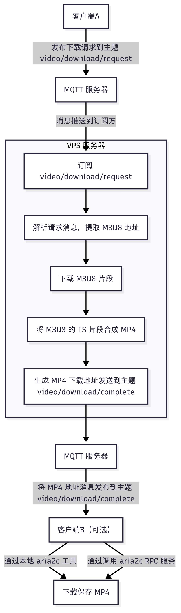
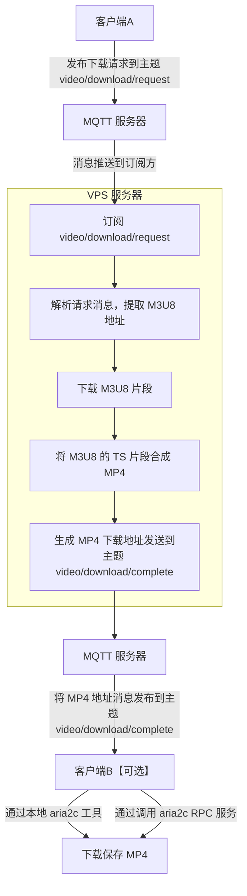

# M3U8 视频下载器

## 介绍
本项目是基于 MQTT 服务器端的 M3U8 视频下载器。

## 先决条件
1. 安装 [uv](https://github.com/astral-sh/uv)。 
    ```bash
    # On macOS and Linux.
    curl -LsSf https://astral.sh/uv/install.sh | sh
    ```
2. 安装 [`m3u8-downloader`](https://github.com/forkdo/m3u8-downloader)（下载至服务器）。
    ```bash
    curl -L https://s.fx4.cn/m3u8-downloader | bash
    ```
3. 安装 [aria2c](https://github.com/aria2/aria2)（下载至本地客户端）。

## 安装

1. 拉取代码并进入项目目录：
   ```bash
   git clone <repository-url>
   cd video-downloader
   ```
2. 安装依赖：
   ```bash
   uv sync
   ```
   
## 使用

### 基于源码部署
1. 启动 MQTT 服务器
    > EMQX 配置客户端认证功能：访问控制 -> 客户端认证 -> 创建 -> Password-Based -> 内置数据库 -> 键入“用户名、密码” -> 保存。
2. 启动本服务
    ```bash
    uv sync
    uv run video-downloader
    ```
3. 使用客户端，发布消息（`JSON`）到主题 `video/download/request`，格式如下：   
建议 `QOS` 为 `0`, `retain` 为 `false`。若 `retain` 为 `true`，则消息会被保留，直到有新的消息发布到相同的主题。会导致重启服务器后，重复下载相同的文件。
    ```bash
    {
      "url": "https://test.com/50941.m3u8",
      "name": "testtest"
    }
    ```
    若忽略 `name`，则会生成随机文件名。

4. 等待下载完成   
下载完成后，会发布消息到主题 `video/download/complete`，格式如下：
    ```json
    {
      "status": "success",
      "url": "https://test.com/wmfx.m3u8",
      "name": "video_1749464069",
      "file_path": "downloads/video_1749464069",
      "download_url": "http://127.0.0.1:3000/video_1749464069.mp4",
      "timestamp": 1749464116
    }
    ```

5. 同步下载到本地客户端   
  当服务器端下载 M3U8 视频，且合并为 MP4 视频后，本地客户端同步下载至本地。
    ```bash
    uv sync
    uv run video-puller    
    ```

### 基于 Docker 部署

- 自构建
    ```bash
     # 构建 
     docker buildx bake
    ```

    **服务端**
    ```bash
     # 运行
     docker run -d -v $(pwd)/downloads:/app/downloads --name video-downloader video-downloader:local

     # 使用环境变量
     docker run -d -v $(pwd)/downloads:/app/downloads -e DOWNLOAD_PREFIX_URL="http://127.0.0.1:8080/" --name video-downloader video-downloader:local
    ```

    **客户端**
    ```bash
     # 使用外置的 aria2 下载视频
     docker run -e ARIA2_RPC_HOST=http://192.168.1.138 -e ARIA2_DOWNLOAD_DIR=test_down -it video-downloader:local video-puller --qos-level 2 --aria2-rpc-token your-secret-key --aria2-rpc-enable 1 --aria2-rpc-download-dir test_download
    
     # 挂载下载目录
     docker run -e ARIA2_DOWNLOAD_DIR=test_down -e QOS_LEVEL=2 -v $(pwd)/aria2down:/app/test_down -it video-downloader:local video-puller

     # aria2c rpc server
     aria2c --enable-rpc --rpc-listen-all=true --rpc-secret=your-secret-key --dir=/downloads
    ```

- 基于 Docker Compose
使用 [**`Docker Compose`**](docker/README.md) 部署，请查阅 `docker/README.md`。

- 使用项目提供的 Docker 镜像

    > **版本：** `latest`, `main`, <`TAG`>

    | Registry                                                                                   | Image                                                  |
    | ------------------------------------------------------------------------------------------ | ------------------------------------------------------ |
    | [**Docker Hub**](https://hub.docker.com/r/idevsig/video-downloader/)                                | `idevsig/video-downloader`                                    |
    | [**GitHub Container Registry**](https://github.com/idevsig/video-downloader/pkgs/container/video-downloader) | `ghcr.io/idevsig/video-downloader`                            |
    | **Tencent Cloud Container Registry**                                                       | `ccr.ccs.tencentyun.com/idevsig/video-downloader`             |
    | **Aliyun Container Registry**                                                              | `registry.cn-guangzhou.aliyuncs.com/idevsig/video-downloader` |

## 配置

配置可以通过（按优先级增加的顺序）设置：
1. 环境变量
2. 项目根目录下的配置文件 `config.toml` 
3. 命令行参数

配置文件 `config.toml`:
```toml
[mqtt]
MQTT_BROKER = "mqtt.eclipseprojects.io"
MQTT_PORT = 1883
QOS_LEVEL = 0
MQTT_TOPIC_SUBSCRIBE = "video/download/request"
MQTT_TOPIC_PUBLISH = "video/download/complete"
MQTT_CLIENT_ID = "video_downloader_client"
DOWNLOAD_DIR = "downloads"
DOWNLOAD_PREFIX_URL = ""
MQTT_USERNAME = ""
MQTT_PASSWORD = ""

[aria2]
ARIA2_RPC_ENABLE = 0
ARIA2_RPC_HOST = "http://localhost"
ARIA2_RPC_PORT = 6800
ARIA2_RPC_TOKEN = "your-secret-key"
ARIA2_DOWNLOAD_DIR = "aria_downloads"
```

- **DOWNLOAD_PREFIX_URL** 用于替换下载文件的 URL 前缀。   
比如文件名为 `test.mp4`，如果配置了此参数值为 `http://127.0.0.1:8080/downloads/`，则下载此 MP4 视频的网址为：`http://127.0.0.1:8080/downloads/test.mp4`。配合 `nginx` 反向代理使用。

命令行参数:
```bash
uv run video-downloader --mqtt-broker mqtt.example.com --mqtt-port 1884
```

## 运行

```bash
uv run video-downloader
```

## 流程图




## 仓库镜像

- https://git.jetsung.com/idev/video-downloader
- https://framagit.org/idev/video-downloader
- https://gitcode.com/idev/video-downloader
- https://github.com/idevsig/video-downloader
